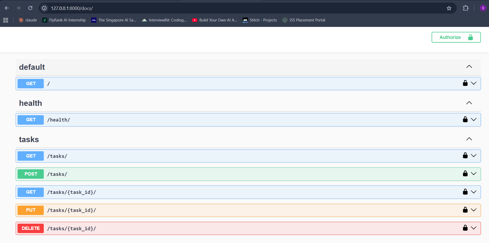

# Task API

A simple CRUD REST API for managing tasks, built with Django + Django REST Framework. Includes interactive Swagger docs via `drf-spectacular`.

## Install & Run

```bash
uv sync && uv run src/manage.py runserver
```

Server starts at `http://127.0.0.1:8000/`. Interactive API docs: `http://127.0.0.1:8000/docs/`

## Endpoints

| Method | Endpoint         | Description                          |
|--------|------------------|---------------------------------------|
| GET    | `/`              | API info (name, version, endpoints)  |
| GET    | `/health/`       | Health check                          |
| GET    | `/tasks/`        | List all tasks                        |
| POST   | `/tasks/`        | Create a new task (`title` required)  |
| GET    | `/tasks/<id>/`   | Get a single task                     |
| PUT    | `/tasks/<id>/`   | Update a task (`title` and/or `done`) |
| DELETE | `/tasks/<id>/`   | Delete a task                         |
| GET    | `/docs/`         | Swagger UI                            |
| GET    | `/api/schema/`   | Raw OpenAPI 3.0 schema                |

## Swagger UI



## Example

```
$ curl -i http://127.0.0.1:8000/tasks/

HTTP/1.1 200 OK
Content-Type: application/json
Vary: Accept

[{"id": 1, "title": "Read book", "done": false}, {"id": 2, "title": "Exercise", "done": true}]
```
